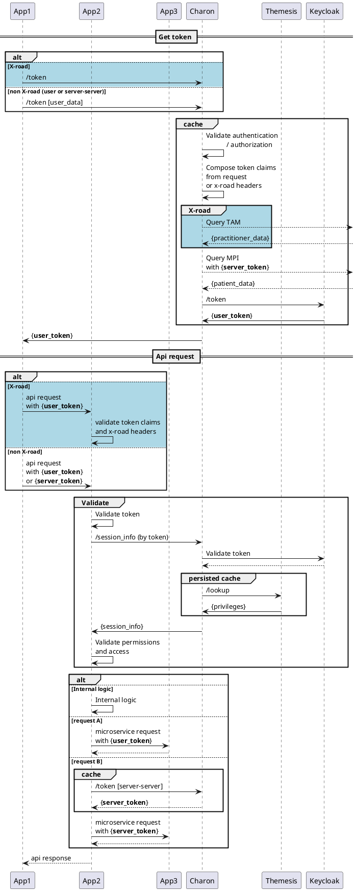

```plantuml
@startuml
participant App1        as app1
participant App2        as app2
participant App3        as app3
participant Charon      as charon
participant Themesis    as themesis
participant Keycloak    as kc

== Get token ==

alt 
else #LightBlue X-road
  app1 -> charon : /token
else #white non X-road (user or server-server)
  app1 -> charon : /token [user_data]
end
group cache
  charon -> charon : Validate authentication\n            / authorization
  charon -> charon : Compose token claims\nfrom request\nor x-road headers
  group #LightBlue X-road
    charon -->] : Query TAM 
    charon <--] : {practitioner_data}
  end
  charon -->] : Query MPI\nwith {<b>server_token</b>}
  charon <--] : {patient_data}
  charon -> kc : /token
  kc -> charon : {<b>user_token</b>}
end
charon -> app1 : {<b>user_token</b>}

== Api request ==

alt 
else #LightBlue X-road
  app1 -> app2 : api request\nwith {<b>user_token</b>}
  app2 -> app2 : validate token claims\nand x-road headers
else #White non X-road
  app1 -> app2 : api request\nwith {<b>user_token</b>}\nor {<b>server_token</b>}
end


group Validate
app2 -> app2: Validate token

app2 -> charon : /session_info (by token)
charon -> kc : Validate token
return
group persisted cache
  charon -> themesis : /lookup
  themesis -> charon : {privileges}
end
charon -> app2 : {session_info}


app2 -> app2 : Validate permissions\nand access
end

alt
else Internal logic
app2 -> app2 : Internal logic
else request A
  app2 -> app3: microservice request\nwith {<b>user_token</b>}
  return
else request B
  group cache
    app2 -> charon : /token [server-server]
    return {<b>server_token</b>}
  end
  app2 -> app3: microservice request\nwith {<b>server_token</b>}
  return
end


app2 --> app1 : api response

@enduml
```
